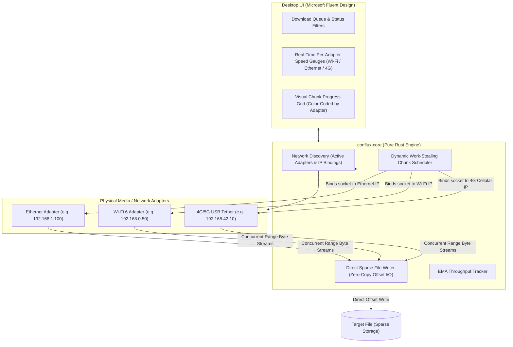

# Conflux ⚡

> **Next-Generation Multi-Source & Multi-Interface Download Accelerator**  
> *Channel bonding across Wi-Fi, Ethernet, and 4G/5G mobile tethering built in Rust & Microsoft Fluent Design.*

[](https://www.rust-lang.org/)
[](https://learn.microsoft.com/en-us/windows/apps/design/)
[](#license)

---

## 🚀 The Core Problem & The Conflux Solution

Standard download managers (including traditional FDM and IDM) accelerate downloads by opening concurrent TCP streams. However, standard operating systems (Windows and Linux) route **all** outgoing packets through a single default network adapter chosen by the routing metric (typically prioritizing wired Ethernet and leaving active Wi-Fi or USB cellular tethering completely idle).

**Conflux breaks this limitation**:
1. **Physical Network Channel Bonding**: Explicitly binds each outgoing TCP socket to the designated local IP address of each physical network card (`local_address(Some(ip))`). This forces the OS kernel to route separate byte-range requests across different physical media simultaneously (e.g. 100 Mbps Ethernet + 50 Mbps Wi-Fi + 40 Mbps 4G = **~190 Mbps aggregate throughput**).
2. **Work-Stealing Dynamic Chunk Scheduler**: Distributes file byte-ranges dynamically based on each adapter's real-time throughput. Faster connections claim more chunks; slower connections take fewer.
3. **Zero-Copy Sparse File Pre-allocation**: Pre-allocates file length instantly (`set_len` / `SetEndOfFile`) and writes chunks non-sequentially at exact byte offsets, eliminating post-download file merging overhead.
4. **Resilient Failover**: If an adapter disconnects mid-download (e.g. Wi-Fi drops or USB phone tether unplugged), pending chunks are automatically released and re-allocated to surviving adapters without corrupting the file or interrupting the transfer.
5. **Modern Microsoft Fluent UI**: Inspired by FDM and Windows 11 Fluent guidelines, featuring real-time adapter speed cards with toggle switches, and a live, segmented visual chunk progress map color-coded by the adapter that downloaded each block.

---

## 📐 System Architecture



---

## 🛠️ Repository Layout

```
conflux/
├── AGENTS.md                          # Repository rules & Karpathy engineering standards
├── Cargo.toml                         # Cargo workspace configuration
├── crates/
│   ├── conflux-core/                  # Pure Rust high-performance download engine
│   │   └── src/
│   │       ├── adapter.rs             # Adapter discovery & local IP socket binding
│   │       ├── chunk.rs               # Non-overlapping byte-range chunk math
│   │       ├── writer.rs              # Zero-copy sparse file writer
│   │       ├── checksum.rs            # Streaming SHA-256 integrity verification
│   │       └── engine.rs              # Multi-adapter work-stealing download coordinator
│   └── conflux-cli/                   # High-speed terminal client
│       └── src/main.rs                # CLI commands (adapters, probe, download)
├── ui/                                # Microsoft Fluent Design Webview UI
│   ├── src/
│   │   ├── components/
│   │   │   ├── TitleBar.tsx           # Windows 11 title bar & global speed pill
│   │   │   ├── NavPane.tsx            # Category navigation rail
│   │   │   ├── DownloadTable.tsx      # Download table with per-adapter speed pills
│   │   │   ├── DetailsPane.tsx        # Selected download details & chunk map
│   │   │   └── AddDownloadDialog.tsx  # New download dialog
│   │   ├── pages/                     # Network & Settings pages
│   │   └── App.tsx
│   └── package.json
└── docs/
    ├── PLAN.md                        # Original architecture & engineering plan
    └── ROADMAP.md                     # Production-readiness roadmap (task list for agents)
```

---

## ⚡ Quickstart

### 1. Inspect Available Network Adapters
Inspect all physical network interfaces detected on your machine:
```bash
cargo run --bin conflux -- adapters
```

### 2. Probe a Remote Endpoint
Inspect file size and Range header support on a remote target:
```bash
cargo run --bin conflux -- probe http://archive.ubuntu.com/ubuntu/dists/noble/main/binary-amd64/Packages.xz
```

### 3. Run a Multi-Interface Download
Download a file with dynamic chunking, sparse allocation, and SHA-256 verification:
```bash
cargo run --bin conflux -- download http://archive.ubuntu.com/ubuntu/dists/noble/main/binary-amd64/Packages.xz -o Packages.xz -s 1
```

### 4. Launch the Fluent UI Dashboard
Run the hot-reloading development server:
```bash
cd ui
npm install
npm run dev
```
Open `http://localhost:5173` to explore the interactive dashboard, adapter toggles, and live color-coded chunk map.

---

## 🧪 Testing & Verification

Conflux follows strict **Karpathy Rules** and **Superpowers (TDD)** quality gates:
```bash
# Run all unit and integration tests
cargo test --workspace

# Check formatting
cargo fmt --check

# Run strict clippy linter (zero warnings)
cargo clippy -- -D warnings
```

---

## 📜 License
Licensed under either of [Apache License, Version 2.0](LICENSE-APACHE) or [MIT License](LICENSE-MIT) at your option.
