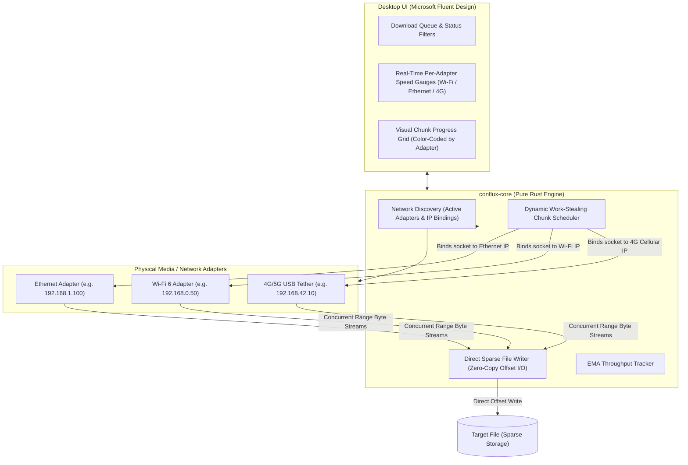

# Conflux ⚡

> **Next-Generation Multi-Source & Multi-Interface Download Accelerator**  
> *Channel bonding across Wi-Fi, Ethernet, and 4G/5G mobile tethering built in Rust & Microsoft Fluent Design.*  
> **Windows 10/11 (64-bit) only · public beta in preparation**

[](https://www.rust-lang.org/)
[](https://learn.microsoft.com/en-us/windows/apps/design/)
[](#-platform-support)
[](#license)

---

## 🚀 The Core Problem & The Conflux Solution

Standard download managers (including traditional FDM and IDM) accelerate downloads by opening concurrent TCP streams. However, Windows routes **all** outgoing packets through a single default network adapter chosen by the routing metric (typically prioritizing wired Ethernet and leaving active Wi-Fi or USB cellular tethering completely idle).

**Conflux breaks this limitation**:
1. **Physical Network Channel Bonding**: Explicitly binds each outgoing TCP socket to the designated local IP address of each physical network card (`local_address(Some(ip))`). This forces the OS kernel to route separate byte-range requests across different physical media simultaneously (e.g. 100 Mbps Ethernet + 50 Mbps Wi-Fi + 40 Mbps 4G = **~190 Mbps aggregate throughput**).
2. **Work-Stealing Dynamic Chunk Scheduler**: Distributes file byte-ranges dynamically based on each adapter's real-time throughput. Faster connections claim more chunks; slower connections take fewer.
3. **Zero-Copy Sparse File Pre-allocation**: Pre-allocates file length instantly (`set_len` / `SetEndOfFile`) and writes chunks non-sequentially at exact byte offsets, eliminating post-download file merging overhead.
4. **Resilient Failover**: If an adapter disconnects mid-download (e.g. Wi-Fi drops or USB phone tether unplugged), pending chunks are automatically released and re-allocated to surviving adapters without corrupting the file or interrupting the transfer.
5. **Modern Microsoft Fluent UI**: Inspired by FDM and Windows 11 Fluent guidelines, featuring real-time adapter speed cards with toggle switches, and a live, segmented visual chunk progress map color-coded by the adapter that downloaded each block.

---

## 🪟 Platform Support

Conflux is built for **Windows 10 and 11 (64-bit)** and is the only platform supported and
shipped. The installer is a per-user NSIS package (it needs the Microsoft WebView2 runtime,
which is present on current Windows). There are no Linux or macOS builds and none are planned.

The engine crate also compiles on Linux. That is a development convenience, not a supported
target: it lets the core test suite run on WSL2 and in cheap Linux CI. See
[docs/DEVELOPMENT.md](docs/DEVELOPMENT.md#platform-policy).

---

## 📐 System Architecture



---

## 🛠️ Repository Layout

```
conflux/
├── AGENTS.md                          # Binding engineering rules for contributors and agents
├── CHANGELOG.md                       # What changed per release
├── Cargo.toml                         # Cargo workspace (conflux-core, conflux-cli, conflux-desktop)
├── crates/
│   ├── conflux-core/                  # Pure Rust download engine (no UI, testable on Linux)
│   │   ├── src/
│   │   │   ├── adapter.rs             # Adapter discovery, link-state filtering, bound HTTP clients
│   │   │   ├── watcher.rs             # OS network-change watcher (hot-join / hot-remove adapters)
│   │   │   ├── chunk.rs               # Non-overlapping byte-range chunk scheduler
│   │   │   ├── engine.rs              # Multi-adapter coordinator: probe, workers, retries, If-Range
│   │   │   ├── writer.rs              # Sparse file writer (exact-offset positional writes)
│   │   │   ├── resume.rs              # Resume sidecar (completed-chunk bitmap + validators)
│   │   │   ├── filename.rs            # Filename sanitising and atomic unique-name claiming
│   │   │   └── checksum.rs            # Streaming SHA-256
│   │   └── tests/                     # Integration tests against a fault-injecting test server
│   ├── conflux-cli/                   # Terminal client (adapters, probe, download)
│   └── conflux-desktop/               # Tauri v2 Windows app
│       ├── src/                       # commands, task state, settings, history, tray, logging,
│       │                              #   diagnostics, adapter overrides
│       ├── capabilities/              # Webview permissions (kept minimal)
│       └── tauri.conf.json            # Window, CSP and NSIS bundle config
├── ui/                                # React + Fluent UI frontend
│   └── src/
│       ├── App.tsx                    # App shell, event wiring, dialogs
│       ├── components/                # Title bar, download table, details pane, dialogs, ...
│       ├── pages/                     # Network and Settings pages
│       ├── hooks/                     # Downloads, settings, speed history, window theme
│       └── dev/mockBackend.ts         # Mock Tauri backend for browser-only development
├── scripts/                           # Version bump/check, docs link check, roadmap status
├── .github/workflows/                 # CI, security scans, monthly dependency report
└── docs/                              # See docs/README.md for the index
    ├── ARCHITECTURE.md                # How it works (kept in step with the code)
    ├── DEVELOPMENT.md                 # Setup, quality gates, CI cost
    ├── ROADMAP.md                     # Path to the public beta (task list for agents)
    ├── guides/                        # How-tos (Windows cross-compilation)
    └── archive/                       # Historical docs (original plan)
```

---

## ⚡ Quickstart

### 1. Inspect Available Network Adapters
Inspect all physical network interfaces detected on your machine:
```bash
cargo run --bin conflux -- adapters
```

### 2. Probe a Remote Endpoint
Inspect file size and Range header support on a remote target:
```bash
cargo run --bin conflux -- probe http://archive.ubuntu.com/ubuntu/dists/noble/main/binary-amd64/Packages.xz
```

### 3. Run a Multi-Interface Download
Download a file with dynamic chunking, sparse allocation, and SHA-256 verification:
```bash
cargo run --bin conflux -- download http://archive.ubuntu.com/ubuntu/dists/noble/main/binary-amd64/Packages.xz -o Packages.xz -s 1
```

### 4. Launch the Fluent UI Dashboard
Run the hot-reloading development server:
```bash
cd ui
npm install
npm run dev
```
Open `http://localhost:5173` to explore the interactive dashboard, adapter toggles, and live color-coded chunk map.

---

## 🧪 Testing & Verification

Conflux follows strict **Karpathy Rules** and **Superpowers (TDD)** quality gates (see
[`AGENTS.md`](AGENTS.md)). On Linux/WSL2, never run a bare `cargo test` — the desktop crate
targets Windows. The short version:
```bash
cargo fmt --check
cargo clippy -p conflux-core --tests -- -D warnings
cargo test -p conflux-core
npm --prefix ui run lint && npm --prefix ui run build
```
The full gate list (Windows clippy for the desktop crate, CLI, version check) is in
[docs/DEVELOPMENT.md](docs/DEVELOPMENT.md).

---

## 📚 Documentation

Start at the [docs index](docs/README.md): [architecture](docs/ARCHITECTURE.md),
[development guide](docs/DEVELOPMENT.md), and the [roadmap](docs/ROADMAP.md) to the public beta.

---

## 📜 License
Licensed under either of [Apache License, Version 2.0](LICENSE-APACHE) or [MIT License](LICENSE-MIT) at your option.
