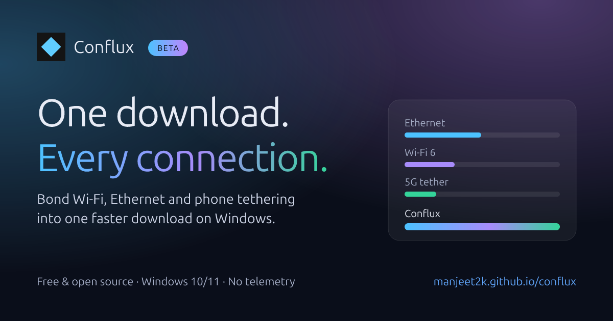
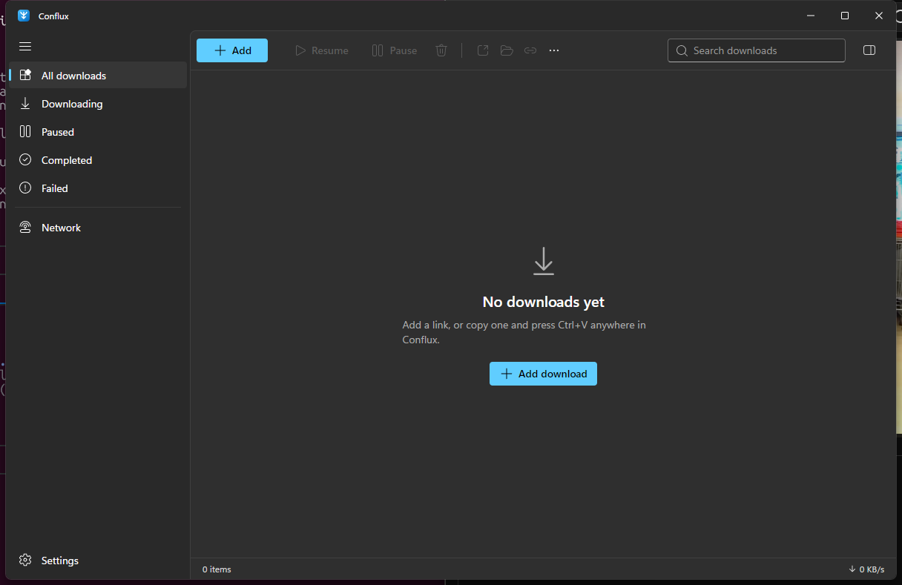

# Conflux ⚡

<p align="center">
  <a href="https://manjeet2k.github.io/conflux/"></a>
</p>

<p align="center">
  <a href="https://manjeet2k.github.io/conflux/"></a>
  <a href="https://github.com/manjeet2k/conflux/releases"></a>
  <a href="https://github.com/manjeet2k/conflux/releases"></a>
  <a href="https://www.rust-lang.org/"></a>
  <a href="LICENSE-MIT"></a>
</p>

> **Next-Generation Channel-Bonding Download Accelerator for Windows**  
> Combine Wi-Fi, Ethernet, and 4G/5G mobile tethering into a single, faster download.  
> **Windows 10/11 (64-bit) only · Public Beta** · [Website](https://manjeet2k.github.io/conflux/) · [Releases](https://github.com/manjeet2k/conflux/releases) · [Documentation](docs/README.md)

<p align="center">
  
</p>

> [!NOTE]
> **Public Beta:** Conflux is actively developed. The beta Windows installer is currently unsigned, so Windows SmartScreen will display an "unknown publisher" prompt on first run (see [Installation](#-installation) below).

---

## ⚡ What is Conflux?

Normally, Windows routes all your download traffic through a single network adapter (usually Ethernet), leaving active Wi-Fi or phone tethering completely idle. 

**Conflux breaks this limitation.** It requests files in small, concurrent chunks and explicitly binds each connection to a specific network adapter. The result: multiple internet connections download the same file together in parallel.

### Key Features

- ⚡ **Multi-Interface Channel Bonding**: Download simultaneously over wired Ethernet, Wi-Fi, and 4G/5G USB mobile tethering.
- 🔄 **Dynamic Work-Stealing**: Automatically assigns more chunks to faster connections, and seamlessly reassigns chunks if an adapter disconnects.
- 💾 **Instant Sparse File Pre-Allocation**: Chunks are written straight to their exact byte positions on disk—no slow, post-download file merging.
- ⏯️ **Reliable Pause & Resume**: Safely pause and resume interrupted downloads with HTTP `If-Range` validation and streaming SHA-256 verification.
- 🪟 **Modern Windows 11 Fluent UI**: Real-time per-adapter speed gauges, toggle switches, and a live color-coded chunk map showing which adapter downloaded each byte.
- 🔒 **Privacy First**: Zero telemetry, zero analytics, no user accounts, and 100% open source.

---

## 📥 Installation

1. Go to the [Releases page](https://github.com/manjeet2k/conflux/releases) and download the latest `0.N.0-beta.K` installer (`Conflux_*_x64-setup.exe`).
2. Run the installer (installs per-user, no administrator rights needed).
3. If Windows shows **"Windows protected your PC"**, follow the instructions below.

### Windows protected your PC / unknown publisher

The beta installer is currently **unsigned** (code-signing certificates are planned after the public beta). Windows SmartScreen will display a blue warning dialog. This is standard for new open-source software:

1. Click **More info** in the blue dialog.
2. Click **Run anyway**.

*(Optional)* You can verify the installer's integrity in PowerShell using the `SHA256SUMS.txt` published with the release:
```powershell
Get-FileHash .\Conflux_*_x64-setup.exe -Algorithm SHA256
Get-Content .\SHA256SUMS.txt
```

---

## ▶️ Quick Start

1. Launch Conflux from the Start menu.
2. Open the **Network** tab to see your active adapters (Ethernet, Wi-Fi, USB tether). Toggle off any connection you don't want to use.
3. Click **Add download**, paste any direct file URL (`http://` or `https://`), select your destination folder, and click **Download**.
4. Watch the per-adapter speed gauges and the live chunk map aggregate your bandwidth in real time!

---

## 📶 Performance Expectations

- **Independent routes required**: Speed aggregation works when your adapters connect through **different physical internet connections** (e.g., Home Broadband on Ethernet + Mobile 4G/5G on USB tethering). Connecting Ethernet and Wi-Fi to the same home router will not double your bandwidth because both share the same ISP line.
- **Server support**: The remote server must support HTTP Range requests (most file hosts and CDNs do). If a server does not support ranges, Conflux downloads safely through a single stream.
- **Real-hardware benchmarks** (Windows 11 Pro, broadband + 4G/5G cellular):
  - Ethernet only: **118.9 Mbit/s**
  - Cellular Wi-Fi only: **46.3 Mbit/s**
  - **Bonded both**: **138.0 Mbit/s** (89.5% multi-adapter scaling efficiency, ~20% faster download).
  - Full benchmark data and methodology: [docs/BENCHMARKS.md](docs/BENCHMARKS.md).

---

## 💻 System Requirements

- **Operating System**: Windows 10 (version 1809 or newer) or Windows 11, 64-bit.
- **Runtime**: Microsoft Edge WebView2 (preinstalled on modern Windows 10/11; installer will fetch it if missing).
- **Network**: Two or more active network connections with independent internet access to benefit from channel bonding (works as a standard download manager on a single connection).

---

## ❓ Frequently Asked Questions

<details>
<summary><strong>Does Conflux work on macOS or Linux?</strong></summary>

No. Conflux is engineered specifically for Windows 10 and 11 (64-bit). The Linux code paths in the repository exist solely to run unit tests in CI and local WSL2 environments.
</details>

<details>
<summary><strong>Does Conflux collect telemetry or personal data?</strong></summary>

No. Conflux includes zero telemetry, crash reporting, analytics, or user accounts. See [PRIVACY.md](PRIVACY.md) for full details.
</details>

<details>
<summary><strong>How do application updates work?</strong></summary>

Conflux checks GitHub Releases for new beta versions. When an update is available, you will receive a notification and can update directly in the app, or manually download the new installer from the Releases page.
</details>

<details>
<summary><strong>Where are my files and settings saved?</strong></summary>

Settings and download history are saved in `%APPDATA%\com.conflux.desktop`. In-progress downloads keep a lightweight `<file>.conflux.json` resume sidecar alongside the target file. Your completed downloads are never altered or removed when uninstalling.
</details>

<details>
<summary><strong>How do I report a bug or request a feature?</strong></summary>

Navigate to **Settings > Copy diagnostics** in the app and paste the output into a [new GitHub issue](https://github.com/manjeet2k/conflux/issues/new/choose). Diagnostics are sanitized automatically to redact personal file paths and URLs.
</details>

---

## 🛠️ Want to Tinker More?

For developers, contributors, and curious users who want to inspect the internals, run benchmarks, or build from source:

| Document | Description |
|---|---|
| 📐 **[Architecture Deep Dive](docs/ARCHITECTURE.md)** | Socket binding mechanics, work-stealing scheduling, sparse file I/O, and sequence diagrams |
| 🛠️ **[Development Guide](docs/DEVELOPMENT.md)** | Environment setup, quality gates, CLI tools (`conflux adapters/probe/download`), and UI dev server |
| 📊 **[Hardware Benchmarks](docs/BENCHMARKS.md)** | Real-world multi-adapter throughput tests, methodology, and raw test logs |
| 📋 **[Windows Test Plan](docs/WINDOWS_TEST_PLAN.md)** | Step-by-step verification checklists for physical Windows hardware |
| ⚠️ **[Known Issues](docs/KNOWN_ISSUES.md)** | Transparent list of current limitations and edge cases |
| 🗺️ **[Roadmap](docs/ROADMAP.md)** | Milestones and tasks on the path to the stable 1.0 release |
| 📜 **[Engineering Guidelines](AGENTS.md)** | Karpathy engineering rules, mathematical invariants, and code standards |

---

## 📜 Policies & License

- **Security**: [SECURITY.md](SECURITY.md) (Coordinated vulnerability disclosure)
- **Privacy**: [PRIVACY.md](PRIVACY.md) (No telemetry or tracking policy)
- **Contributing**: [CONTRIBUTING.md](CONTRIBUTING.md) and [CODE_OF_CONDUCT.md](CODE_OF_CONDUCT.md)
- **License**: Dual-licensed under [MIT](LICENSE-MIT) OR [Apache-2.0](LICENSE-APACHE).
