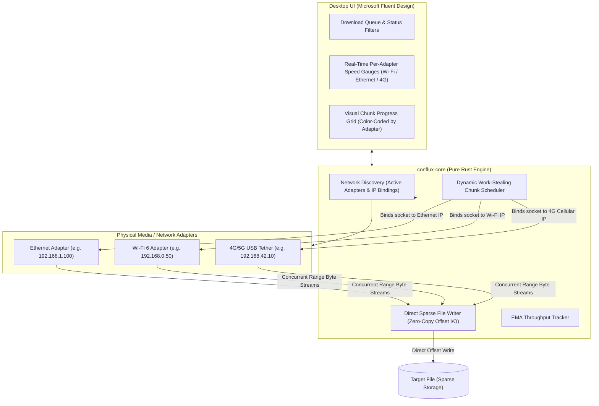

# Conflux ⚡

> **Next-Generation Multi-Source & Multi-Interface Download Accelerator**  
> *Channel bonding across Wi-Fi, Ethernet, and 4G/5G mobile tethering built in Rust & Microsoft Fluent Design.*  
> **Windows 10/11 (64-bit) only · public beta in preparation**

[](https://www.rust-lang.org/)
[](https://learn.microsoft.com/en-us/windows/apps/design/)
[](#-platform-support)
[](#license)


> [!WARNING]
> **BETA SOFTWARE.** Conflux is in public beta. Expect rough edges, report bugs, and do not rely on
> it for anything critical yet. The Windows installer is **not code-signed**, so Windows will warn
> you before running it (see [Windows protected your PC](#windows-protected-your-pc--unknown-publisher)).
> Releases are published on GitHub as pre-releases named `0.N.0-beta.K`.

<!-- SCREENSHOT PLACEHOLDER: main window with a download running over two adapters.
     Add the image under docs/images/ and link it here. Not yet captured. -->
<!-- GIF PLACEHOLDER: short capture of a bonded download with the per-adapter speed pills. Not yet recorded. -->
*Screenshots and a short GIF of a bonded download will go here once captured.*

---

## 📥 Install

1. Open the [Releases page](https://github.com/manjeet2k/conflux/releases) and pick the newest
   `0.N.0-beta.K` pre-release.
2. Download the installer (`Conflux_..._x64-setup.exe`) **and** `SHA256SUMS.txt` from the same release.
3. [Verify the download](#verify-the-download-sha256) (recommended, takes 10 seconds).
4. Run the installer. It installs per user (no administrator rights needed). If Windows shows
   "Windows protected your PC", follow the next section.
5. If the Microsoft WebView2 runtime is missing (rare on current Windows 10/11), the installer
   downloads it, which needs an internet connection.

> The repository is private until the beta opens; the Releases link works once it is public.

### Windows protected your PC / unknown publisher

The beta installer is **unsigned**: code-signing certificates cost money and need identity
verification, and the project deferred that until after the beta. Windows SmartScreen therefore
shows a blue "Windows protected your PC" dialog saying the publisher is unknown. That is expected
for any unsigned installer, and by itself it does not mean the file is malicious. To continue:

1. In the blue dialog click **More info**.
2. Click **Run anyway**.

Because the warning cannot vouch for the file, verify it yourself against the checksum published
with the release. Only run installers downloaded from the project's GitHub Releases page.

### Verify the download (SHA256)

Each release includes `SHA256SUMS.txt`. In PowerShell, from the folder with the installer:

```powershell
Get-FileHash .\Conflux_*_x64-setup.exe -Algorithm SHA256
Get-Content .\SHA256SUMS.txt
```

The hash printed by the first command must match the line for the same file name in the second
(case does not matter). If it differs, delete the file and download it again; if it still
differs, do not run it and [report it](SECURITY.md).

## ▶️ First run: your first bonded download

1. Start Conflux from the Start menu. Open the **Network** page: every active adapter with a
   usable IPv4 address is listed (Ethernet, Wi-Fi, USB tether). Leave the ones you want on.
2. Click **Add download**, paste a direct `http://` or `https://` file URL, choose a folder, and start.
3. Watch the per-adapter speeds and the chunk map: each coloured block was downloaded over the
   adapter with that colour.
4. When it finishes you get a notification (if enabled in Settings), and the file appears in the
   list and in your history. Closing the window sends Conflux to the tray by default.

To see a real gain you need at least two adapters that are connected to the internet at the same
time (for example Ethernet and Wi-Fi, or Wi-Fi and a phone tethered over USB) and a server that
supports HTTP Range requests (most do).

## 🔀 How bonding works, in plain words

Normally Windows sends all your traffic out of one network connection, the one it ranks best,
and the others sit idle. Conflux asks the server for a file in many small pieces ("give me bytes
0 to 8 MB", "now 8 to 16 MB", ...) and deliberately sends each request out of a **specific**
adapter by binding the connection to that adapter's own address. Fast adapters finish pieces
sooner and so take more of them; if an adapter drops out, its unfinished pieces are handed to the
others. The pieces are written straight to their place in the file, so there is no merge step at
the end.

### How much gain to expect (honest version)

- Gains add up only when the links are **independent physical connections that each have their
  own route to the internet** (their own router or gateway), such as wired Ethernet plus a phone
  tether, or two different ISPs. Ethernet plus Wi-Fi on the **same** router share one internet
  line, so the total is capped by that line and you may see little or no gain.
- The server must be fast enough, and must allow range requests; otherwise Conflux falls back to
  a single stream.
- An adapter that has no gateway of its own may connect but move no data. See
  [known issues](docs/KNOWN_ISSUES.md).
- Real-hardware measurements have not been published yet:
  **BENCHMARK PLACEHOLDER** - results will be taken from [docs/BENCHMARKS.md](docs/BENCHMARKS.md).
  Until then, treat any specific speed-up number as unproven.
- Windows 10/11 x64 only. **Linux and macOS are not supported.**

## 💻 System requirements

- Windows 10 (version 1809 or newer) or Windows 11, 64-bit.
- Microsoft Edge WebView2 runtime (preinstalled on current Windows; the installer fetches it if absent).
- Two or more active network adapters to benefit from bonding (one works, as a normal download manager).

## ❓ FAQ

**Why does Windows show "Windows protected your PC"?** The beta installer is not code-signed, so
SmartScreen does not know the publisher. See [the section above](#windows-protected-your-pc--unknown-publisher).

**How do updates work?** Conflux checks the project's GitHub Releases for a newer beta and can
update itself in the app. That check is the only network request the app makes on its own. You can
always download the new installer from the Releases page instead and verify it with `SHA256SUMS.txt`.

**Where is my data stored?** Settings are in the app config folder and the download history in the
app data folder, both under `%APPDATA%\com.conflux.desktop` (exact paths as given by Windows). Logs
are in the app log folder (typically under `%LOCALAPPDATA%\com.conflux.desktop\logs`);
**Settings > Open logs folder** opens it. Unfinished downloads keep a small `<file>.conflux.json`
resume file next to the partial file. Your downloaded files are never touched by uninstalling.

**Does Conflux send telemetry?** No. No analytics, no crash reporting, no accounts. See
[PRIVACY.md](PRIVACY.md).

**How do I report a bug?** Use **Copy diagnostics** in Settings and paste it into a
[new issue](https://github.com/manjeet2k/conflux/issues/new/choose). It is built from an allow-list and
masks paths, URLs and the host part of IP addresses (adapter names are included as-is). Review it before posting.

**Does it work on Linux or macOS?** No. Windows 10/11 x64 only.

**Is it safe?** The code is open; the installer is unsigned. Verify checksums, download only from
the Releases page, and report vulnerabilities as described in [SECURITY.md](SECURITY.md).

---
---

## 🚀 The Core Problem & The Conflux Solution

Standard download managers (including traditional FDM and IDM) accelerate downloads by opening concurrent TCP streams. However, Windows routes **all** outgoing packets through a single default network adapter chosen by the routing metric (typically prioritizing wired Ethernet and leaving active Wi-Fi or USB cellular tethering completely idle).

**Conflux breaks this limitation**:
1. **Physical Network Channel Bonding**: Explicitly binds each outgoing TCP socket to the designated local IP address of each physical network card (`local_address(Some(ip))`). This forces the OS kernel to route separate byte-range requests across different physical media simultaneously (e.g. 100 Mbps Ethernet + 50 Mbps Wi-Fi + 40 Mbps 4G = **~190 Mbps aggregate throughput**).
2. **Work-Stealing Dynamic Chunk Scheduler**: Distributes file byte-ranges dynamically based on each adapter's real-time throughput. Faster connections claim more chunks; slower connections take fewer.
3. **Zero-Copy Sparse File Pre-allocation**: Pre-allocates file length instantly (`set_len` / `SetEndOfFile`) and writes chunks non-sequentially at exact byte offsets, eliminating post-download file merging overhead.
4. **Resilient Failover**: If an adapter disconnects mid-download (e.g. Wi-Fi drops or USB phone tether unplugged), pending chunks are automatically released and re-allocated to surviving adapters without corrupting the file or interrupting the transfer.
5. **Modern Microsoft Fluent UI**: Inspired by FDM and Windows 11 Fluent guidelines, featuring real-time adapter speed cards with toggle switches, and a live, segmented visual chunk progress map color-coded by the adapter that downloaded each block.

---

## 🪟 Platform Support

Conflux is built for **Windows 10 and 11 (64-bit)** and is the only platform supported and
shipped. The installer is a per-user NSIS package (it needs the Microsoft WebView2 runtime,
which is present on current Windows). There are no Linux or macOS builds and none are planned.

The engine crate also compiles on Linux. That is a development convenience, not a supported
target: it lets the core test suite run on WSL2 and in cheap Linux CI. See
[docs/DEVELOPMENT.md](docs/DEVELOPMENT.md#platform-policy).

---

## 📐 System Architecture



---

## 🛠️ Repository Layout

```
conflux/
├── AGENTS.md                          # Binding engineering rules for contributors and agents
├── CHANGELOG.md                       # What changed per release
├── Cargo.toml                         # Cargo workspace (conflux-core, conflux-cli, conflux-desktop)
├── crates/
│   ├── conflux-core/                  # Pure Rust download engine (no UI, testable on Linux)
│   │   ├── src/
│   │   │   ├── adapter.rs             # Adapter discovery, link-state filtering, bound HTTP clients
│   │   │   ├── watcher.rs             # OS network-change watcher (hot-join / hot-remove adapters)
│   │   │   ├── chunk.rs               # Non-overlapping byte-range chunk scheduler
│   │   │   ├── engine.rs              # Multi-adapter coordinator: probe, workers, retries, If-Range
│   │   │   ├── writer.rs              # Sparse file writer (exact-offset positional writes)
│   │   │   ├── resume.rs              # Resume sidecar (completed-chunk bitmap + validators)
│   │   │   ├── filename.rs            # Filename sanitising and atomic unique-name claiming
│   │   │   └── checksum.rs            # Streaming SHA-256
│   │   └── tests/                     # Integration tests against a fault-injecting test server
│   ├── conflux-cli/                   # Terminal client (adapters, probe, download)
│   └── conflux-desktop/               # Tauri v2 Windows app
│       ├── src/                       # commands, task state, settings, history, tray, logging,
│       │                              #   diagnostics, adapter overrides
│       ├── capabilities/              # Webview permissions (kept minimal)
│       └── tauri.conf.json            # Window, CSP and NSIS bundle config
├── ui/                                # React + Fluent UI frontend
│   └── src/
│       ├── App.tsx                    # App shell, event wiring, dialogs
│       ├── components/                # Title bar, download table, details pane, dialogs, ...
│       ├── pages/                     # Network and Settings pages
│       ├── hooks/                     # Downloads, settings, speed history, window theme
│       └── dev/mockBackend.ts         # Mock Tauri backend for browser-only development
├── SECURITY.md  PRIVACY.md            # Vulnerability reporting; what the app does with your data
├── CONTRIBUTING.md  CODE_OF_CONDUCT.md
├── scripts/                           # Version bump/check, docs link check, roadmap status
│   └── bench/                         # Benchmark kit: range-capable test server + adapter counters
├── .github/workflows/                 # CI, security scans, monthly dependency report
└── docs/                              # See docs/README.md for the index
    ├── ARCHITECTURE.md                # How it works (kept in step with the code)
    ├── DEVELOPMENT.md                 # Setup, quality gates, CI cost
    ├── ROADMAP.md                     # Path to the public beta (task list for agents)
    ├── WINDOWS_TEST_PLAN.md           # PASS/FAIL checklists for real Windows machines
    ├── BENCHMARKS.md                  # Bonding benchmark method and results
    ├── KNOWN_ISSUES.md                # Honest list of current limitations
    ├── guides/                        # How-tos (Windows cross-compilation)
    └── archive/                       # Historical docs (original plan)
```

---

## ⚡ Developer quickstart (command line)

### 1. Inspect Available Network Adapters
Inspect all physical network interfaces detected on your machine:
```bash
cargo run --bin conflux -- adapters
```

### 2. Probe a Remote Endpoint
Inspect file size and Range header support on a remote target:
```bash
cargo run --bin conflux -- probe http://archive.ubuntu.com/ubuntu/dists/noble/main/binary-amd64/Packages.xz
```

### 3. Run a Multi-Interface Download
Download a file with dynamic chunking, sparse allocation, and SHA-256 verification:
```bash
cargo run --bin conflux -- download http://archive.ubuntu.com/ubuntu/dists/noble/main/binary-amd64/Packages.xz -o Packages.xz -s 1
```

### 4. Launch the Fluent UI Dashboard
Run the hot-reloading development server:
```bash
cd ui
npm install
npm run dev
```
Open `http://localhost:5173` to explore the interactive dashboard, adapter toggles, and live color-coded chunk map.

---

## 🧪 Testing & Verification

Conflux follows strict **Karpathy Rules** and **Superpowers (TDD)** quality gates (see
[`AGENTS.md`](AGENTS.md)). On Linux/WSL2, never run a bare `cargo test` — the desktop crate
targets Windows. The short version:
```bash
cargo fmt --check
cargo clippy -p conflux-core --tests -- -D warnings
cargo test -p conflux-core
npm --prefix ui run lint && npm --prefix ui run build
```
The full gate list (Windows clippy for the desktop crate, CLI, version check) is in
[docs/DEVELOPMENT.md](docs/DEVELOPMENT.md).

---

## 📚 Documentation

Start at the [docs index](docs/README.md): [architecture](docs/ARCHITECTURE.md),
[development guide](docs/DEVELOPMENT.md), [known issues](docs/KNOWN_ISSUES.md), and the
[roadmap](docs/ROADMAP.md) to the public beta. Policies: [security](SECURITY.md),
[privacy](PRIVACY.md), [contributing](CONTRIBUTING.md), [code of conduct](CODE_OF_CONDUCT.md).

---

## 📜 License
Licensed under either of [Apache License, Version 2.0](LICENSE-APACHE) or [MIT License](LICENSE-MIT) at your option.
