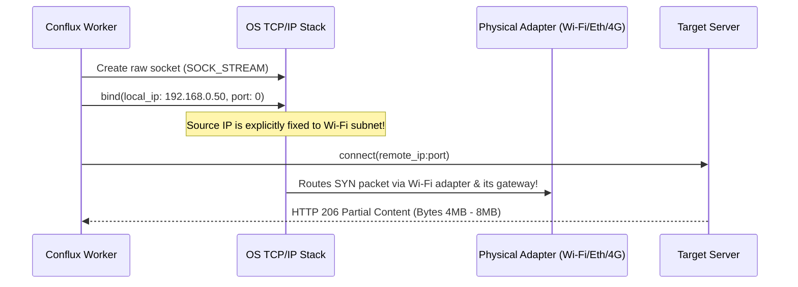

# Conflux: Architecture & Channel Bonding Deep Dive

## 1. The Single-Gateway Bottleneck in Standard Operating Systems

In standard operating systems (Windows and Linux), when an application initiates an outgoing TCP connection using a default socket (`INADDR_ANY`), the OS kernel consults the system IP routing table:

```text
Destination     Gateway         Netmask         Interface       Metric
0.0.0.0         192.168.1.1     0.0.0.0         192.168.1.100   25  (Ethernet)
0.0.0.0         192.168.0.1     0.0.0.0         192.168.0.50    35  (Wi-Fi 6)
0.0.0.0         192.168.42.1    0.0.0.0         192.168.42.10   45  (4G USB Tether)
```

By default, the kernel always selects the route with the **lowest metric** (Ethernet with metric 25).
- Result: **100% of download traffic flows through Ethernet**. Active Wi-Fi and 4G USB tethering connections remain **0% utilized**.

---

## 2. The Conflux Channel Bonding Mechanism

Conflux breaks this limitation by performing **explicit local IP socket binding**:



### The Rust Implementation
In `crates/conflux-core/src/adapter.rs`:
```rust
let mut builder = reqwest::Client::builder()
    .connect_timeout(Duration::from_secs(5))
    .timeout(Duration::from_secs(30));

if let Some(adapter_ip) = local_ip {
    // Explicitly bind outbound TCP socket to the physical adapter IP
    builder = builder.local_address(Some(adapter_ip));
}

let client = builder.build()?;
```

When `local_address` is set, the OS kernel's ARP/routing decision table matches the source IP address to the subnet of the corresponding physical network interface card (NIC), bypassing the global default gateway metric!

---

## 3. Work-Stealing Chunk Scheduling Algorithm

Conflux partitions the target file into dynamic chunks (e.g. 4 MB default):

```text
[ Chunk 0: 0 - 4MB ]   [ Chunk 1: 4MB - 8MB ]   [ Chunk 2: 8MB - 12MB ] ...
```

### Dynamic Work-Stealing Protocol:
1. An asynchronous pool of worker threads is spawned for each active network interface (e.g. 4 workers on Ethernet, 4 on Wi-Fi, 4 on 4G).
2. As soon as any worker becomes idle, it atomically claims the next `Pending` chunk from the work-stealing queue.
3. **Automatic Bandwidth Balancing**:
   - A 100 Mbps Ethernet connection will finish and claim 4 chunks in the time a 25 Mbps connection claims 1 chunk.
   - Bandwidth aggregation is naturally self-balancing without complex static partitioning.
4. **Fault-Tolerant Failover**:
   - If an adapter drops (e.g. Wi-Fi disconnection or socket timeout), the worker catches the error, marks the chunk status back to `Pending`, and logs the failure.
   - Surviving workers on the remaining adapters automatically steal the uncompleted chunk and download it without corrupting the file or interrupting the download.

---

## 4. Zero-Copy Sparse File Pre-Allocation

Traditional download managers often download separate `.part` files for each connection and concatenate them together at the end, causing heavy disk thrashing and high completion latency on large files (e.g. 50 GB games).

Conflux uses **sparse file pre-allocation**:
1. When the download initializes, `SparseFileWriter::create` pre-allocates the complete target file size instantly:
   - On Windows: Sets `EndOfFile` via `SetFileInformationByHandle`.
   - On Linux: Calls `ftruncate`.
2. Workers write incoming stream buffers **directly to their exact byte offsets**:
   ```rust
   writer.write_at(chunk.start + stream_offset, &bytes).await?;
   ```
3. Chunks can arrive in any order (e.g. Chunk 7 finishes before Chunk 2). They are written to their respective disk positions with zero intermediate merging.
4. Once all chunks are marked `Completed`, `writer.sync()` flushes the OS file buffers and triggers a streaming SHA-256 calculation to guarantee 100% data integrity.
