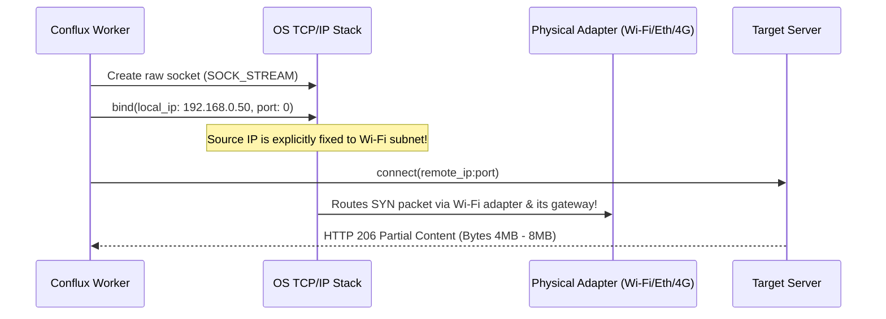

# Conflux: Architecture & Channel Bonding Deep Dive

## 1. The Single-Gateway Bottleneck in Standard Operating Systems

In Windows (and most other operating systems), when an application initiates an outgoing TCP connection using a default socket (`INADDR_ANY`), the OS kernel consults the system IP routing table:

```text
Destination     Gateway         Netmask         Interface       Metric
0.0.0.0         192.168.1.1     0.0.0.0         192.168.1.100   25  (Ethernet)
0.0.0.0         192.168.0.1     0.0.0.0         192.168.0.50    35  (Wi-Fi 6)
0.0.0.0         192.168.42.1    0.0.0.0         192.168.42.10   45  (4G USB Tether)
```

By default, the kernel always selects the route with the **lowest metric** (Ethernet with metric 25).
- Result: **100% of download traffic flows through Ethernet**. Active Wi-Fi and 4G USB tethering connections remain **0% utilized**.

---

## 2. The Conflux Channel Bonding Mechanism

Conflux breaks this limitation by performing **explicit local IP socket binding**:



### The Rust Implementation
In `crates/conflux-core/src/adapter.rs`, `build_bound_http_client(local_ip, interface, stall_timeout)`:
```rust
let mut builder = reqwest::Client::builder()
    .connect_timeout(CONNECT_TIMEOUT)
    .read_timeout(stall_timeout);
if let Some(ip) = local_ip {
    builder = builder.local_address(Some(ip));      // bind the source IP
}
#[cfg(target_os = "linux")]
if let Some(name) = interface.filter(|n| !n.is_empty()) {
    builder = builder.interface(name);              // SO_BINDTODEVICE
}
```

Windows is the only supported platform; the Linux code paths below exist only so the core
tests run on the WSL2 dev host and in Linux CI.

Binding the source IP alone does not pin the egress interface on weak-host-model stacks
(Linux by default): the kernel may still route out of another NIC carrying this NIC's
source address. On **Linux** (dev/test only) the engine therefore also passes the OS interface name
(`BindTarget::interface` in `engine.rs`, taken from `NetworkAdapter::name`), which sets
`SO_BINDTODEVICE`. On **Windows** only the source-IP bind is used (the `interface`
argument is ignored), so true per-adapter egress there depends on the routing table and is
still to be verified on real hardware.

---

---

## 3. Work-Stealing Chunk Scheduling Algorithm

Conflux partitions the target file into dynamic chunks (e.g. 4 MB default):

```text
[ Chunk 0: 0 - 4MB ]   [ Chunk 1: 4MB - 8MB ]   [ Chunk 2: 8MB - 12MB ] ...
```

### Dynamic Work-Stealing Protocol:
1. An asynchronous pool of worker threads is spawned for each active network interface (e.g. 4 workers on Ethernet, 4 on Wi-Fi, 4 on 4G).
2. As soon as any worker becomes idle, it atomically claims the next `Pending` chunk from the work-stealing queue.
3. **Automatic Bandwidth Balancing**:
   - A 100 Mbps Ethernet connection will finish and claim 4 chunks in the time a 25 Mbps connection claims 1 chunk.
   - Bandwidth aggregation is naturally self-balancing without complex static partitioning.
4. **Fault-Tolerant Failover**:
   - If an adapter drops (e.g. Wi-Fi disconnection or socket timeout), the worker catches the error, marks the chunk status back to `Pending`, and logs the failure.
   - Surviving workers on the remaining adapters automatically steal the uncompleted chunk and download it without corrupting the file or interrupting the download.

---

## 4. Zero-Copy Sparse File Pre-Allocation

Traditional download managers often download separate `.part` files for each connection and concatenate them together at the end, causing heavy disk thrashing and high completion latency on large files (e.g. 50 GB games).

Conflux uses **sparse file pre-allocation**:
1. When the download initializes, `SparseFileWriter::create` (`writer.rs`) pre-allocates the complete target file size instantly:
   - On Windows: first marks the file sparse (`FSCTL_SET_SPARSE`, best effort, in `mark_sparse`), then `set_len` moves `EndOfFile`. Without the sparse flag NTFS zero-fills everything before a far-offset write.
   - On Linux (dev/test only): `set_len` (`ftruncate`) leaves a sparse file.
   - `SparseFileWriter::open_existing` reopens a partial file for resume without truncating it.
2. Workers write incoming stream buffers **directly to their exact byte offsets**:
   ```rust
   writer.write_at(chunk.start + stream_offset, &bytes).await?;
   ```
3. Chunks can arrive in any order (e.g. Chunk 7 finishes before Chunk 2). They are written to their respective disk positions with zero intermediate merging.
4. Once all chunks are marked `Completed`, `writer.sync()` flushes the OS file buffers 

---

## 5. Adapter Discovery, Link State and the Watcher

- **Discovery** (`discover_adapters` in `adapter.rs`) lists interface addresses and classifies each as enabled/disabled (loopback, link-local, IPv6 and virtual/VPN/bridge adapters are listed but disabled by default).
- **Link-state filtering**: only adapters that can carry traffic are reported. On Linux the interface must have `IFF_UP` and `IFF_RUNNING` (`is_linux_interface_operational`; an unplugged cable keeps its static IP but loses RUNNING). On Windows the adapter's `OperStatus` must be Up and the address must have passed duplicate address detection, i.e. DAD state Preferred (`is_windows_address_operational`). The Windows path is compiled but not yet run on a real host.
- **Watcher** (`watcher.rs`, `NetworkWatcher`): OS notifications (`NotifyUnicastIpAddressChange` on Windows, a `NETLINK_ROUTE` socket on Linux) trigger a debounced rescan; `diff_adapters` turns the result into add/remove/toggle changes published on a `tokio::sync::watch` channel. The OS listener is registered **before** the first scan so a change between the two is never lost. If registration fails or the listener dies, a fallback poller rescans every `FALLBACK_POLL_INTERVAL` (5 s). It must be started inside a Tokio runtime (the desktop app does this in `lib.rs` setup).
- **Adapter overrides** (`settings.rs`, `adapters.rs`): the user's enable/disable choices are stored in `Settings::adapter_overrides` keyed by **interface name**, so they survive DHCP address changes. Older settings used `"<name>:<ip>"` keys; `Settings::normalized` runs `adapters::migrate_overrides` on load (an existing plain-name key wins; the result is idempotent). `commands::set_override` writes the name key and drops legacy keys for that name; `apply_overrides` still honours a legacy key only when no name key exists.

## 6. Engine Resilience (`engine.rs`)

- **Resume validation**: `probe` records `ETag`, `Last-Modified`, size and range support. Every chunk `GET` sends `If-Range` with a strong ETag, else `Last-Modified` (`if_range_validator`; weak ETags are not valid there). A `200` answer to a ranged request means the validator no longer matches: the engine records `resource_changed`, stops, and fails with *"the file changed on the server during the download; start it again"* rather than splicing two versions. The resume sidecar (`resume.rs`, `validate`) is checked against the fresh probe before reuse.
- **Last-usable-adapter guard**: after `MAX_CONSECUTIVE_ADAPTER_FAILURES` (3) failures an adapter is dropped for this download, but never if it is the last live one; the per-chunk budget (`MAX_CHUNK_ATTEMPTS`, 5) then decides. Drop decisions take the `adapter_states` write lock so concurrent workers take turns.
- **Default-route fallback**: if no usable adapter remains (or none was selected), an unbound client (`BindTarget { ip: None }`) uses the OS default route. When a new explicit adapter joins, the fallback is retired (`retire_default_route`) only after that adapter completes a chunk, so a flaky new adapter cannot strand the download.
- **Output paths**: `filename.rs::claim_unique_path` picks `name (n).ext` and claims it atomically with `create_new`, so concurrent downloads (even across processes, e.g. CLI and desktop) never share a path. The desktop app uses its own `commands::reserve_output_path`, which does the same and also skips paths in the in-process `reserved_paths` set, because a resumed task's file may be missing on disk while its engine is about to recreate it.

## 7. Desktop App (`conflux-desktop`)

- **Settings semantics**: `update_settings` holds the `settings` write lock across validation, save and replace, serialising it against `set_adapter_enabled`. `Settings::apply_update` ignores the UI's copy of `adapter_overrides` and keeps the current one, so a stale UI cannot undo an adapter toggle. Files are saved with `write_atomic`.
- **Task control**: `stop_task` takes the `handles` lock; if no engine handle exists yet it pauses the task while still holding the lock, and `spawn_task` re-checks the task is still `Downloading` under that same lock before spawning, so a pause or remove racing a start can never leave an unstoppable download. A running task is cancelled via its watch channel and aborted after `STOP_TIMEOUT`.
- **`quit_gracefully`** (`lib.rs`): guarded by an `AtomicBool` so repeated close/quit requests do not race; hides the window, pauses all downloads (`pause_all_internal`), saves history, then exits. Used by the tray quit item and by window close when close-to-tray is off.
- **Mark-of-the-Web**: on Windows, completed files get a `Zone.Identifier` stream (`ZoneId=3`, credentials stripped from `HostUrl`, CR/LF removed) via `write_mark_of_the_web`. Best effort; non-NTFS volumes only log a warning. Not yet run on real Windows.
- **Webview hardening**: `tauri.conf.json` sets a strict CSP (`default-src 'self'`, `script-src 'self'`, `connect-src ipc: http://ipc.localhost`, `object-src 'none'`, `frame-ancestors 'none'`, ...). `capabilities/default.json` grants only core defaults, minimize, toggle-maximize, close, start-dragging and `dialog:allow-open`; Rust-side plugins (opener, notification) need no capability. Not yet verified in the real Windows webview.
