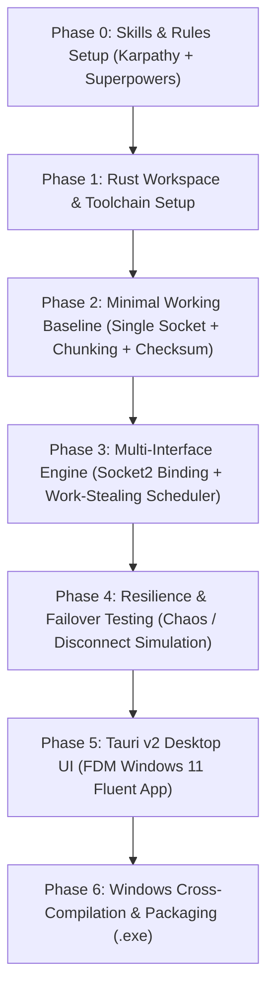

> **Historical document.** This is the original design plan and no longer tracks the code. See [ARCHITECTURE.md](ARCHITECTURE.md) for how it works now and [ROADMAP.md](ROADMAP.md) for what is planned.

# Conflux: Native Windows Multi-Source & Multi-Interface Download Accelerator

A native, blazing-fast Windows download manager (inspired by Free Download Manager / Internet Download Manager) powered by **Rust** and **Tauri v2**, featuring **network channel bonding** to aggregate bandwidth across all active network media (Wi-Fi, Ethernet, USB 4G/5G mobile tethering) and multiple mirror sources.

---

## 1. Goal Description

Standard download managers route 100% of network traffic through a single default network gateway chosen by the OS metric (typically preferring wired Ethernet and ignoring active Wi-Fi or mobile tethering connections).

**Conflux** uses a native **Rust engine** and **Tauri v2** to provide:
1. **Low-Level Socket Binding (`socket2` / `tokio::net::TcpSocket`)**:
   Directly binds each outgoing TCP socket to the specific local IP address of each physical network adapter (`SocketAddr::new(adapter_ip, 0)`). This forces the Windows TCP/IP stack to route outbound requests across different physical media simultaneously (e.g. 100 Mbps Ethernet + 50 Mbps Wi-Fi + 40 Mbps 4G = ~190 Mbps aggregate throughput).
2. **Blazing Fast Zero-Cost Abstractions**:
   - Zero garbage collection pauses.
   - Microsecond-level work-stealing chunk scheduling across threads.
   - Direct asynchronous zero-copy sparse file writing (`tokio::fs::File::set_len` + direct offset writes).
3. **FDM-Inspired Windows 11 Native UI (Tauri v2 + WebView2)**:
   - Modern Fluent / Glassmorphic UI with native Windows window framing, system tray, and notifications.
   - **Real-Time Multi-Adapter Dashboard**: Live speed gauges and sparklines showing concurrent utilization of Ethernet, Wi-Fi, and Cellular.
   - **Interactive Visual Chunk Progress Map**: Visual segmented chunk grid color-coded by the adapter downloading each block.
   - **Connection Worker Matrix**: Inspect live socket streams, active byte ranges, and mirror responses per connection.

---

## 2. Engineering Framework: Karpathy Rules & Superpowers

All development strictly adheres to:

### 2.1 Andrej Karpathy Engineering Principles
1. **First Principles & Full Stack Understanding**: Understand every layer from raw TCP socket options (`SO_BINDTODEVICE`, Winsock `bind`) and HTTP/1.1 Range headers down to disk sector pre-allocation (`set_len`). No cargo-culting.
2. **Minimal Working Baseline First**: Start with a simple, robust end-to-end baseline (e.g. single-file, 2 chunks over 1 socket with SHA-256 validation) before scaling to multi-adapter concurrency and GUI complexity.
3. **Inspect the Data (Never Guess)**: Directly log and inspect byte offsets, chunk boundaries, HTTP status codes, socket local IP bindings, and network throughput. Never assume an adapter is being used without verifying outgoing packets.
4. **Make It Work, Make It Right, Make It Fast**:
   - *Phase A (Work)*: Functional correctness and chunk integrity.
   - *Phase B (Right)*: Clean architecture, error handling, adapter failover, and boundary resilience.
   - *Phase C (Fast)*: Zero-copy I/O, SIMD/lock-free queues, and memory footprint minimization.
5. **Simplicity Over Cleverness**: Prefer explicit, clean, readable Rust and JS code over opaque macros or premature abstractions.

### 2.2 Superpowers Framework
1. **Test-Driven Invariants & Integrity (TDD)**: Every chunk scheduler and file writer feature must have an automated test asserting byte-level correctness before merging.
2. **Scientific Hypothesis-Driven Debugging**: When a socket or write fails, formulate a concrete hypothesis, verify it with targeted logs or isolated reproduction scripts, and fix the root cause rather than patching symptoms.
3. **Resilience & Chaos Verification**: Systematically test fault injection: disconnect an adapter mid-download, simulate a dropped connection, test 0-byte files, and verify that Conflux seamlessly re-routes chunks without corrupting the final SHA-256 hash.
4. **Quality Gates**: Every commit must pass formatting (`cargo fmt`), linting (`cargo clippy`), unit tests (`cargo test`), and cross-compilation check (`cargo check --target x86_64-pc-windows-gnu`).

---

## 3. Implementation Roadmap

- **Phase 0**: Skills & Rules Setup (`AGENTS.md` + `.agents/skills/karpathy-rules/`, `.agents/skills/superpowers/`, `.agents/skills/conflux-dev/`).
- **Phase 1**: Rust toolchain installation (`rustup`), target `x86_64-pc-windows-gnu`, and Cargo workspace creation.
- **Phase 2**: Minimal working baseline (Karpathy Rule #2): CLI download engine validating chunks and SHA-256 checksums over a single adapter.
- **Phase 3**: Multi-interface channel bonding engine (`conflux-core`): `socket2` local IP binding, work-stealing chunk scheduler, direct sparse file writer.
- **Phase 4**: Resilience testing (Superpowers): dynamic adapter disconnect & chunk reassignment testing.
- **Phase 5**: Tauri v2 desktop UI with live speed gauges and visual chunk map.
- **Phase 6**: Cross-compilation and packaging native Windows `.exe`.
